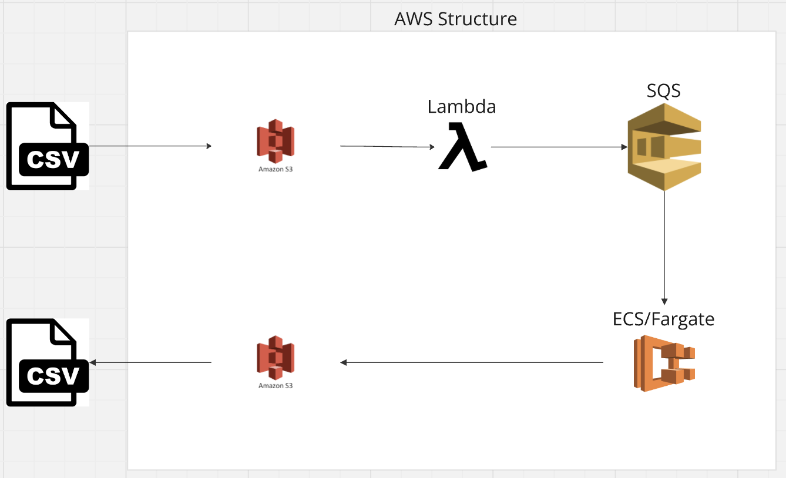

# Serempre Technical

## Tools used and structure

I used the AWS structure, the tools that I've used was:

- S3
  - To storage CSV from source (bronze) to target (silver) layers.
- Lambda 
  - To listen s3 and send the events to SQS.
- SQS
  - To handle the events that comes from S3.
- ECS/Fargate
  - This is where I deployed the code to manipulate the data, move original file to another place, and create has many file we need to, creating task with the deployed code, and a service to keep it running.
- IAM
  - Used this to manage the permissions between the tools, and give permission to people.
- CloudWatch
  - This one is to check logs and use this to solve some bugs or problems that happens.
- CloudFormation
  - To follow up the creation of the ECS Cluster.
- ECR
  - Used to storage Docker image.

Below, how I create the structure on the AWS (I tried to keep similar to GCP).

---

## The code:

- Dockerfile
  - This is the configuration of the Docker, with the image (python) and the code (microservice).
- Jupyter Notebook
  - This is the code that I used to debug, and validate the ideas to solve the test.
- Lambda Handler
  - This is the code that is deployed on the Lambda inside of the AWS.
- Microservice
  - This is the core code, which split the data frame into countries data frames, save all of them into the s3, anonymizes the data.

---

## Next steps

- Create monitoring to validate the script.
- Data Quality above the data (Validate the output).
- Create tests for the function.
- Create CI/CD to keep it consistent.
